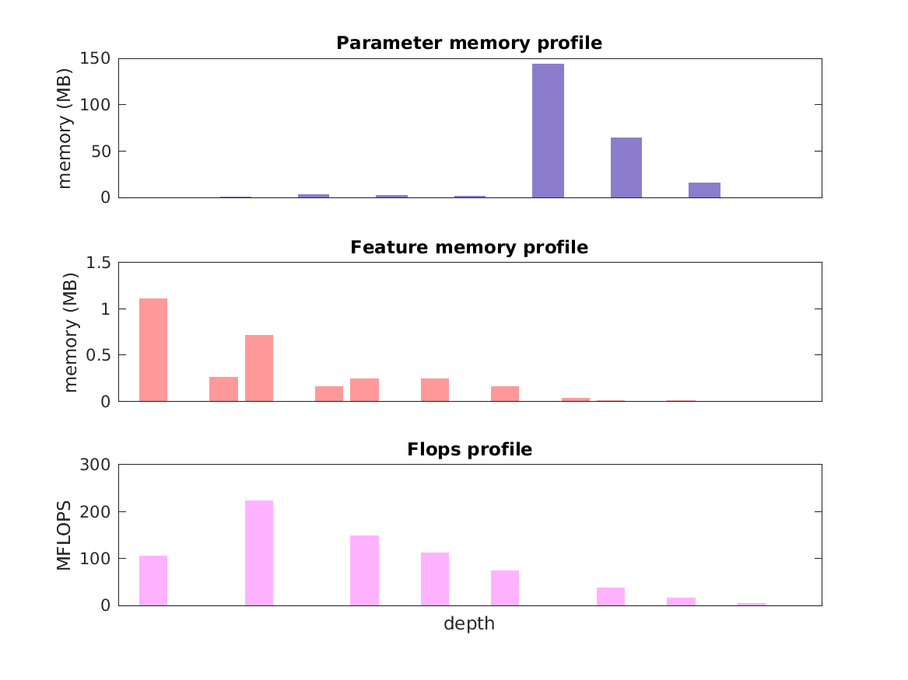

### Report for alexnet
Model params 233 MB 

Estimates for a single full pass of model at input size 227 x 227: 

* Memory required for features: 3 MB 
* Flops: 727 MFLOPS 

Estimates are given below of the burden of computing the `pool5` features in the network for different input sizes using a batch size of 128: 

| input size | feature size | feature memory | flops | 
|------------|--------------|----------------|-------| 
| 114 x 114 | 2 x 2 x 256 | 73 MB | 15 GFLOPS |
| 227 x 227 | 6 x 6 x 256 | 377 MB | 86 GFLOPS |
| 341 x 341 | 9 x 9 x 256 | 872 MB | 200 GFLOPS |
| 454 x 454 | 13 x 13 x 256 | 2 GB | 361 GFLOPS |
| 568 x 568 | 16 x 16 x 256 | 2 GB | 572 GFLOPS |
| 681 x 681 | 20 x 20 x 256 | 4 GB | 829 GFLOPS |

A rough outline of where in the network memory is allocated to parameters and features and where the greatest computational cost lies is shown below.  The x-axis does not show labels (it becomes hard to read for networks containing hundreds of layers) - it should be interpreted as depicting increasing depth from left to right.  The goal is simply to give some idea of the overall profile of the model: 

