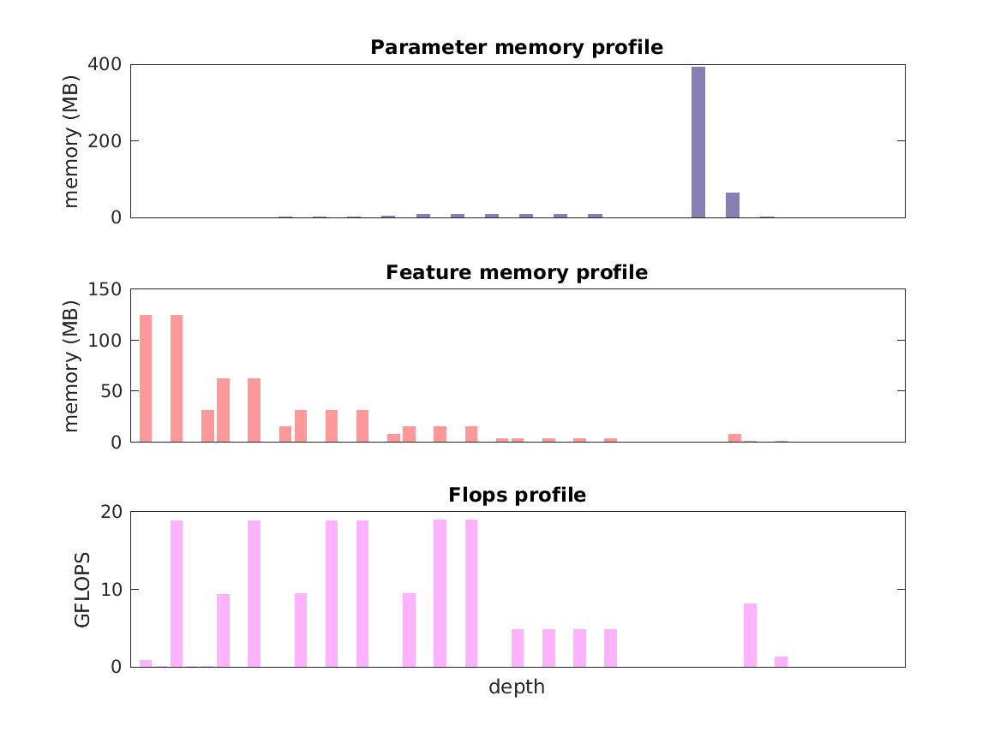

### Report for faster-rcnn-vggvd-pascal
Model params 523 MB 

Estimates for a single full pass of model at input size 600 x 850: 

* Memory required for features: 600 MB 
* Flops: 172 GFLOPS 

Estimates are given below of the burden of computing the `relu5_3` features in the network for different input sizes using a batch size of 128: 

| input size | feature size | feature memory | flops | 
|------------|--------------|----------------|-------| 
| 300 x 425 | 19 x 27 x 512 | 18 GB | 5 TFLOPS |
| 600 x 850 | 38 x 54 x 512 | 73 GB | 20 TFLOPS |
| 900 x 1275 | 57 x 80 x 512 | 164 GB | 45 TFLOPS |
| 1200 x 1700 | 75 x 107 x 512 | 292 GB | 80 TFLOPS |
| 1500 x 2125 | 94 x 133 x 512 | 456 GB | 125 TFLOPS |
| 1800 x 2550 | 113 x 160 x 512 | 657 GB | 181 TFLOPS |

A rough outline of where in the network memory is allocated to parameters and features and where the greatest computational cost lies is shown below.  The x-axis does not show labels (it becomes hard to read for networks containing hundreds of layers) - it should be interpreted as depicting increasing depth from left to right.  The goal is simply to give some idea of the overall profile of the model: 

