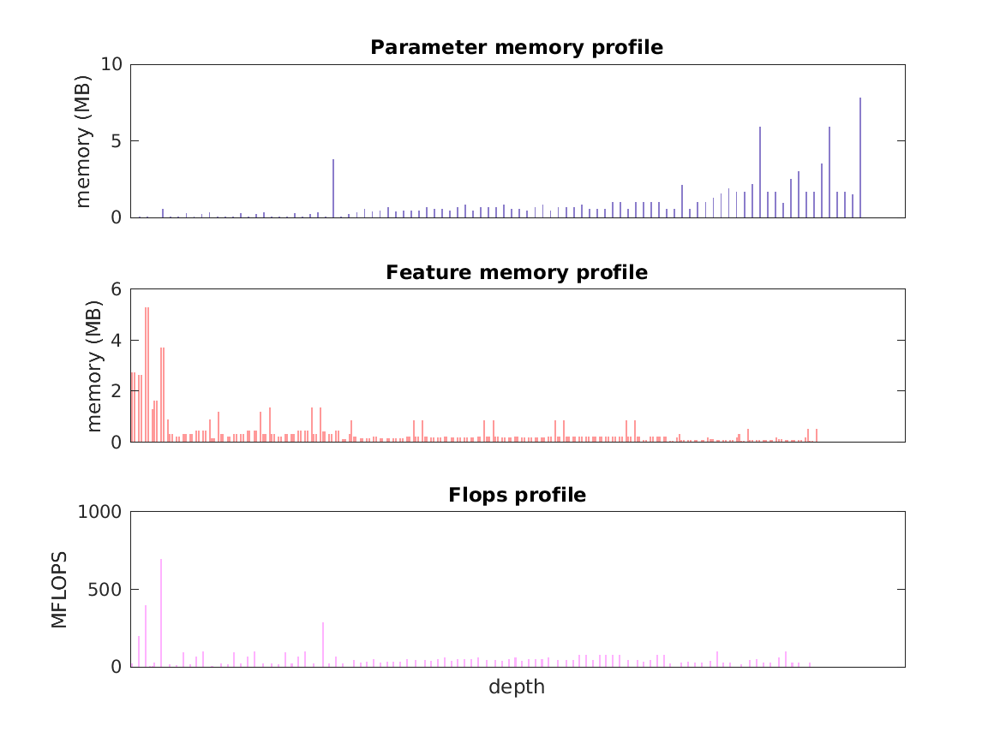

### Report for inception-v3
Model params 91 MB 

Estimates for a single full pass of model at input size 299 x 299: 

* Memory required for features: 89 MB 
* Flops: 6 GFLOPs 

Estimates are given below of the burden of computing the `features_19` features in the network for different input sizes using a batch size of 128: 

| input size | feature size | feature memory | flops | 
|------------|--------------|----------------|-------| 
| 299 x 299 | 1 x 1 x 2048 | 11 GB | 735 GFLOPs |
| 449 x 449 | 1 x 1 x 2048 | 26 GB | 2 TFLOPs |
| 598 x 598 | 2 x 2 x 2048 | 47 GB | 3 TFLOPs |
| 748 x 748 | 2 x 2 x 2048 | 75 GB | 5 TFLOPs |
| 897 x 897 | 3 x 3 x 2048 | 108 GB | 7 TFLOPs |

A rough outline of where in the network memory is allocated to parameters and features and where the greatest computational cost lies is shown below.  The x-axis does not show labels (it becomes hard to read for networks containing hundreds of layers) - it should be interpreted as depicting increasing depth from left to right.  The goal is simply to give some idea of the overall profile of the model: 

