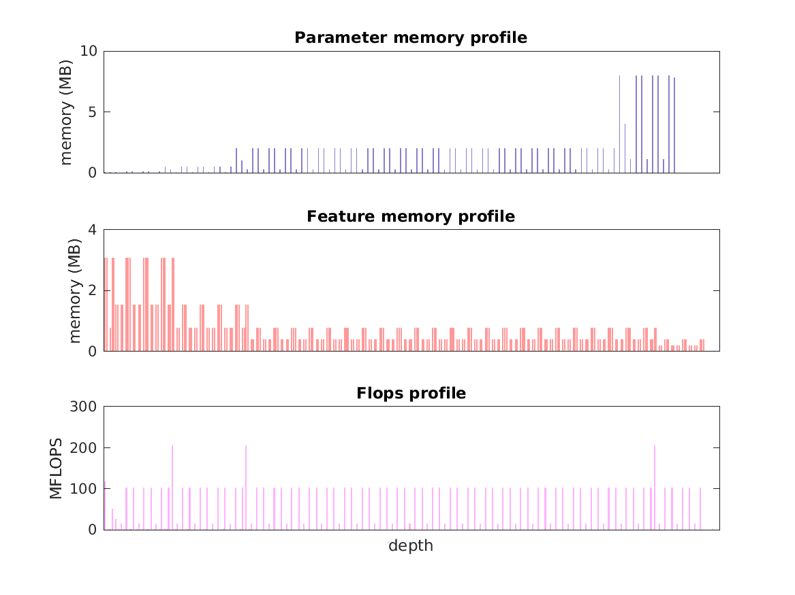

### Report for resnext-101-32x4d
Model params 169 MB 

Estimates for a single full pass of model at input size 224 x 224: 

* Memory required for features: 197 MB 
* Flops: 8 GFLOPS 

Estimates are given below of the burden of computing the `features_7_2_id_relu` features in the network for different input sizes using a batch size of 128: 

| input size | feature size | feature memory | flops | 
|------------|--------------|----------------|-------| 
| 112 x 112 | 4 x 4 x 2048 | 6 GB | 263 GFLOPS |
| 224 x 224 | 7 x 7 x 2048 | 25 GB | 1 TFLOPS |
| 336 x 336 | 11 x 11 x 2048 | 56 GB | 2 TFLOPS |
| 448 x 448 | 14 x 14 x 2048 | 98 GB | 4 TFLOPS |
| 560 x 560 | 18 x 18 x 2048 | 154 GB | 6 TFLOPS |
| 672 x 672 | 21 x 21 x 2048 | 221 GB | 9 TFLOPS |

A rough outline of where in the network memory is allocated to parameters and features and where the greatest computational cost lies is shown below.  The x-axis does not show labels (it becomes hard to read for networks containing hundreds of layers) - it should be interpreted as depicting increasing depth from left to right.  The goal is simply to give some idea of the overall profile of the model: 

