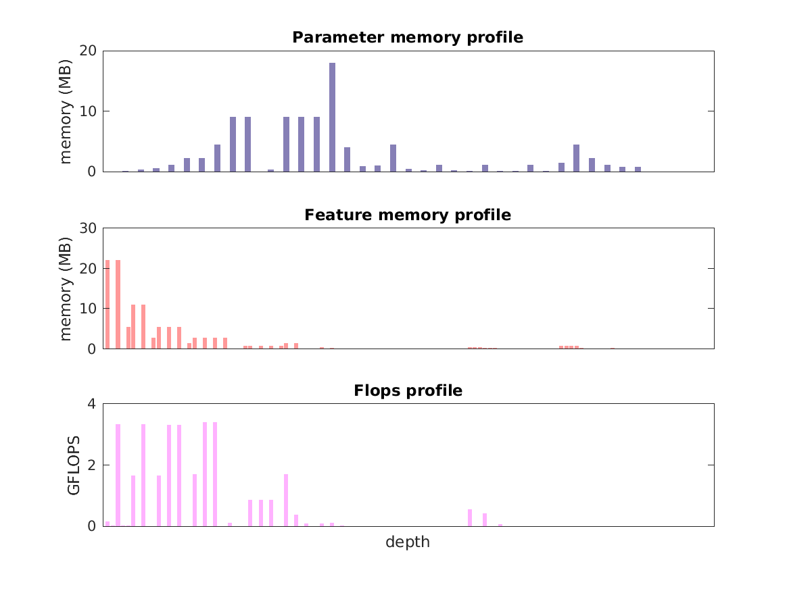

### Report for ssd-pascal-vggvd-300
Model params 100 MB 

Estimates for a single full pass of model at input size 300 x 300: 

* Memory required for features: 116 MB 
* Flops: 31 GFLOPS 

Estimates are given below of the burden of computing the `relu4_3` features in the network for different input sizes using a batch size of 128: 

| input size | feature size | feature memory | flops | 
|------------|--------------|----------------|-------| 
| 150 x 150 | 19 x 19 x 512 | 3 GB | 818 GFLOPS |
| 300 x 300 | 38 x 38 x 512 | 13 GB | 3 TFLOPS |
| 450 x 450 | 57 x 57 x 512 | 28 GB | 7 TFLOPS |
| 600 x 600 | 75 x 75 x 512 | 50 GB | 13 TFLOPS |
| 750 x 750 | 94 x 94 x 512 | 78 GB | 20 TFLOPS |
| 900 x 900 | 113 x 113 x 512 | 113 GB | 29 TFLOPS |

A rough outline of where in the network memory is allocated to parameters and features and where the greatest computational cost lies is shown below.  The x-axis does not show labels (it becomes hard to read for networks containing hundreds of layers) - it should be interpreted as depicting increasing depth from left to right.  The goal is simply to give some idea of the overall profile of the model: 

