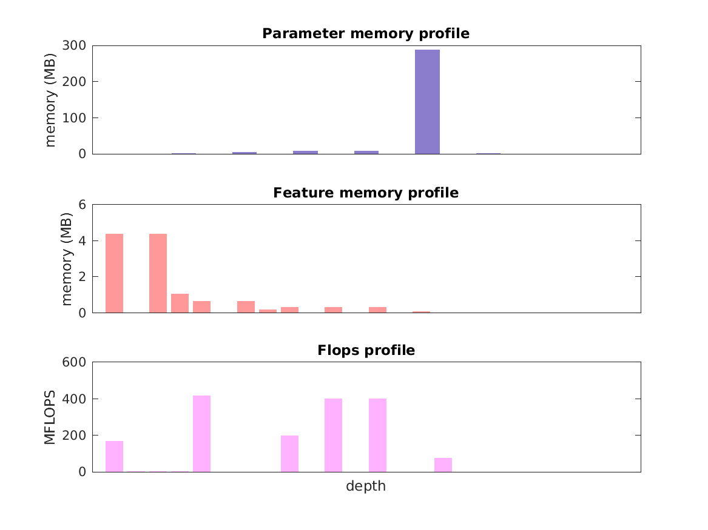

### Report for vgg-m-128
Model params 315 MB 
Estimates for a single full pass of model at input size 224 x 224: 

* Memory required for features: 12 MB 
* Flops: 2 GFLOPS 

Estimates are given below of the burden of computing the `pool5` features in the network for different input sizes: 

| input size | feature size | feature memory | flops | 
 | 112 x 112 | 3 x 3 x 512 | 365 MB | 44 GFLOPS |
 | 224 x 224 | 6 x 6 x 512 | 2 GB | 204 GFLOPS |
 | 336 x 336 | 10 x 10 x 512 | 4 GB | 480 GFLOPS |
 | 448 x 448 | 13 x 13 x 512 | 6 GB | 874 GFLOPS |
 | 560 x 560 | 17 x 17 x 512 | 10 GB | 1 TFLOPS |
 | 672 x 672 | 20 x 20 x 512 | 15 GB | 2 TFLOPS |

A rough outline of where in the network memory is allocated to parameters and features and where the greatest computational cost lies is shown below.  The x-axis does not show labels (it becomes hard to read with the networks containing hundreds of layers) - it should be interpreted as depicting increasing depth from left to right.  The goal is to give some idea of the overall profile of the model: 

